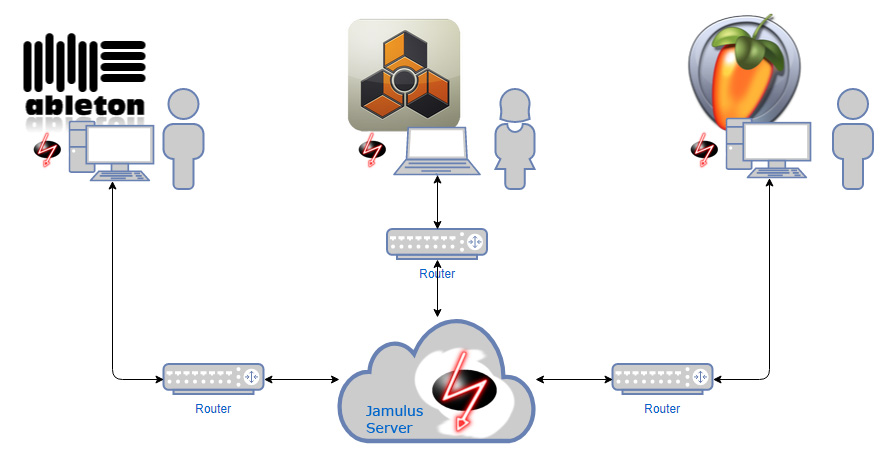

# Online Jam
Make use of Jamulus and jam online with others using your DAW.

If you are looking for a guide on how to set up Jamulus using just your soundcard, please have a look here:
https://github.com/corrados/jamulus/blob/master/src/res/homepage/manual.md

This tutorial is for setting up Jamulus using your DAW in combination with a virtual soundcard instead of a direct I/O of your hardware soundcard. Currently only targeting Windows. Feel free to add wiki pages for your OS at will.

### Prerequisites

* Your DAW (whatever u use)
* Voicemeeter Banana (Win only): https://www.vb-audio.com/Voicemeeter/banana.htm
* Jamulus: https://sourceforge.net/projects/llcon/files/
* *Optional*: An internet faced private installation of *"Jamulus Server"*

### What you can expect
Although technically working imho this sucks! It's really hard to set up even for nerds. Audio quality highly depends on the connection quality of the connected clients. And this is not only ping or distance to the chosen server. The overall experience is only as good as the weekest part of the jam session and although every prerequisite seems to be fulfilled the result can be annoying.

If you still feel the need of starting an adventure, please refer to the Wiki pages for details:

https://github.com/dichternebel/online-jam/wiki/Jamulus-Home
