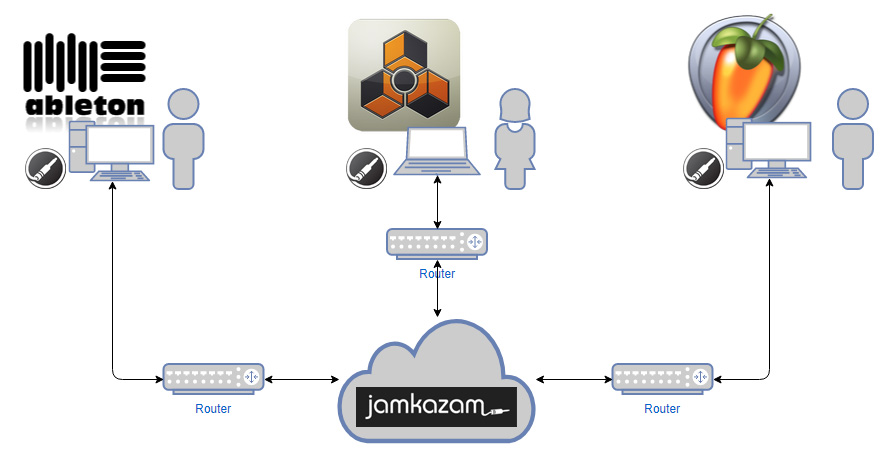

# Online Jam
Make use of jamkazam and jam online with others using your DAW.

This tutorial is for setting up JamKazam using your DAW in combination with a virtual soundcard instead of a direct I/O of your hardware soundcard. Currently only targeting Windows. Feel free to add wiki pages for your OS at will.

### Prerequisites

* Your DAW (whatever u use)
* Voicemeeter Banana (Win only): https://www.vb-audio.com/Voicemeeter/banana.htm
* JamKazam: https://www.jamkazam.com/downloads
* An activated account at jamkazam.com with a confirmed email address

### Setup & Configuration

**Don't use WIFI! It won't work!!!** 
If you have no possibility to get a wired connection you should stop right now and wouldn't waste time. Your internet connection also has to be stable in order to produce a stream without too much jitter.

Of course you should have a soundcard with an ASIO driver that doesn't suck, but since you want to jam using your DAW this should be obviously the case.

### What you'll get
You and your m8s will have an audio based online jam and hear the same audio at the same time. In addition JamKazam offers a metronome in your session making it easier to sync with others. 

### What you'll get...not!
There will be no real sync: No wordclock, no midi-sync, no Ableton Link or whatever you are using. You will have to sync manually and agree to a tempo at the beginning of each song. 🤷 

Please refer to the Wiki pages for details:

https://github.com/dichternebel/online-jam/wiki

---
### Obsolete & not recommended
Although I won't recommend using Jamulus, here is a guide on how to use and set that up
-> [Online Jam with Jamulus](Jamulus)

