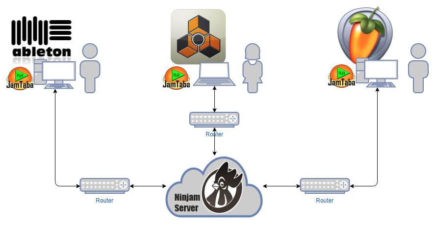

# Online Jam
Make use of JamTaba and jam online with others using your DAW.

This tutorial is for setting up JamTaba using your DAW in combination with a virtual soundcard instead of a direct I/O of your hardware soundcard. Currently only targeting Windows. Feel free to add wiki pages for your OS at will.

### Prolog
OK! Fine! This is day 6 of my odyssee of setting up a satisfying and stable environment for jamming online using my DAW.

I tried these in following order:
1. sofasession
2. Jamulus
3. JamKazam
4. JamTaba (Ninjam)

Sofasession seems to have issues with infrastructure. Server is down too often. No SSL/TLS. Not working with setting up configuration using a web browser.
Jamulus produced weird sound and we had issues with latency. Imho this would only work in a LAN environment or by accident.
JamKazam worked one day, the next day we had quality issues, drop-outs, horrible latency. The UI is laggy as hell. It seems like there is an HTML5 UI running on IE9 if you know what I mean. Also JamKazam dropped the ASIO connection from time to time with the latest update.

JamTaba compared to the others is super easy to use and to configure. It worked for me within 5 min. I had a random jam session with two guys and the sound was really good providing a jammable latency. The session was stable and I did not hear any glitches, crackles whatsoever.

I think the main difference between Ninjam and all others is the approach of making the server part as stupid as possible by just passing the streams to the clients and by using OGG Vorbis instead of Opus. But I'm only guessing.

**So I highly recommend not wasting your time trying out anything but JamTaba or Ninjam.**

Regarding the usage of Voicemeeter Banana I noticed glitches and drop-outs when running my sound card with ASIO buffer sizes below 256 samples. This might be an issue with my hardware, but since it works without Voicemeeter... WTF!? Luckily, I found an excellent alternative so my latest advise is also not to use Voicemeeter as a virtual ASIO device.

### Short introduction to Ninjam

Ninjam was made by the guys at Cockos who are also doing Reaper. They are amazing!
Ninjam is available as a plugin in Reaper so you can jam online with others directly within Reaper. If you are already using Reaper as your DAW and just want to jam using some of your instruments or tracks you already can do so. Then, CU! ;-)

https://www.cockos.com/ninjam/

### Is this tut really for you?

Let's say you are on Mac and you are using Ableton Live then you should better quit, because the brilliant guys at Expert Sleepers made a plugin just for you:
https://www.expert-sleepers.co.uk/ninjamplugin.html

If you want a single instrument within your DAW being a part of an online jam then you just want to download JamTaba and use it as a VST-Plugin and you're already done.

But if you want your complete DAW acting like one instrument then this tutorial is exactly for you.
JamTaba comes as a stand-alone client and as a 64bit VST-Plugin fully supporting Ninjam and we will set this up now.

### Prerequisites

* Your DAW (whatever u use)
* ASIO Link Pro (Win only): https://give.academy/downloads/2018/03/03/ODeusASIOLinkPro/
* Alternative to ^/easier to set up than ^/might work for you is Voicemeeter Banana (Win only): https://www.vb-audio.com/Voicemeeter/banana.htm
* JamTaba: https://jamtaba-music-web-site.appspot.com/?#download

### Setup & Configuration

**Don't use WIFI! It won't work!!!** 
If you have no possibility to get a wired connection you should stop right now and wouldn't waste time. Your internet connection also has to be stable in order to produce a stream without too much jitter.

Of course you should have a soundcard with an ASIO driver that doesn't suck, but since you want to jam using your DAW this should be obviously the case.

### What you'll get
You and your m8s will have an audio based online jam and hear the same audio at the same time. In addition JamTaba offers a metronome in your session making it easier to sync with others. 

### What you'll get...not!
There will be no real sync: No wordclock, no midi-sync, no Ableton Link or whatever you are using. You will have to sync manually and agree to a tempo at the beginning of each song. 🤷 

Please refer to the Wiki pages for details:

https://github.com/dichternebel/online-jam/wiki

---
### Other approaches but not recommended

-> [Online Jam with Jamulus](Jamulus.md) 
-> [Online Jam with JamKazam](JamKazam.md) 
