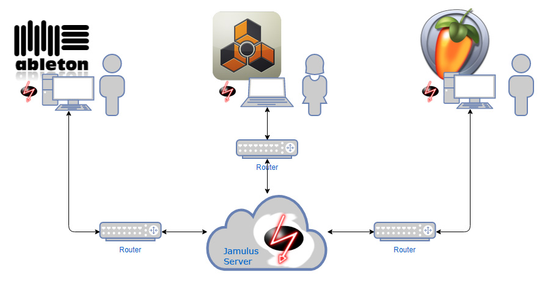

# Online Jam
Make use of Jamulus and jam online with others using your DAW.

If you are looking for a guide on how to set up Jamulus using just your soundcard, please have a look here:
https://github.com/corrados/jamulus/blob/master/src/res/homepage/manual.md

This tutorial is for setting up Jamulus using your DAW in combination with a virtual soundcard instead of a direct I/O of your hardware soundcard. Currently only targeting Windows. Feel free to add wiki pages for your OS at will.

### Prerequisites

* Your DAW (whatever u use)
* Voicemeeter Banana (Win only): https://www.vb-audio.com/Voicemeeter/banana.htm
* Jamulus: https://sourceforge.net/projects/llcon/files/
* An internet faced installation of *"Jamulus Server"*

### Setup & Configuration

**Don't use WIFI! It won't work!!!** 
If you have no possibility to get a wired connection you should stop right now and wouldn't waste time. Your internet connection also has to be stable in order to produce a stream without too much jitter.

Of course you should have a soundcard with an ASIO driver that doesn't suck, but since you want to jam using your DAW this should be obviously the case.

### What you'll get
You and your m8s will have an audio based online jam and hear the same audio at the same time. The drawback: You will add a lot of latency to your current system. So during the jam you should switch between the jam audio and your own set if you want to play live and unquantized. 

### What you'll get...not!
There will be no sync: No wordclock, no midi-sync, no Ableton Link or whatever you are using. You will have to sync manually and agree to a tempo at the beginning of each song. 🤷 

If you still feel the need of starting an adventure, please refer to the Wiki pages for details:

https://github.com/dichternebel/online-jam/wiki

